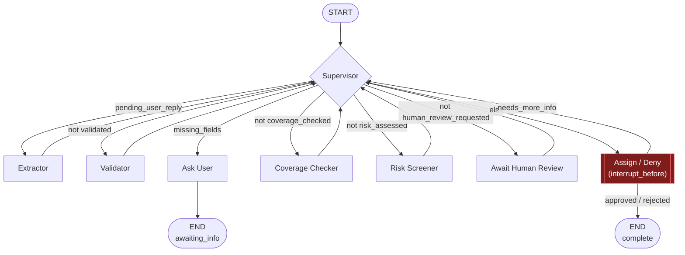

# Insurance Intake Agents (LangGraph Multi-Agent)

Two independent multi-agent intake pipelines, both built with LangGraph:

- **Policy application intake** (below) — `main.py` / `state.py` / `schema.py` / `tools.py` / `supervisor.py` / `graph.py` / `agents/`
- **[FNOL claims intake](#fnol-first-notice-of-loss-claims-intake)** — `fnol_main.py` / `fnol_state.py` / `fnol_schema.py` / `fnol_tools.py` / `fnol_supervisor.py` / `fnol_graph.py` / `fnol_agents/`

They share a folder but no code — separate module names throughout so
neither pipeline can clobber the other.

---

## Policy Application Intake

A multi-agent **auto insurance policy application intake** pipeline built with
LangGraph. Collects applicant + vehicle details across turns, validates
completeness/format, screens underwriting risk, and produces a structured
application record.

### Architecture

```
              ┌─────────────┐
   User ─────►│ Supervisor  │◄────────────────┐
              └──────┬──────┘                 │
                      │ routes to              │
       ┌──────────────┼───────────────┬────────┴──────┐
       ▼               ▼               ▼               ▼
 ┌───────────┐  ┌────────────┐  ┌────────────┐  ┌────────────────┐
 │ Extractor │  │ Validator  │  │ Risk       │  │ Ask User       │
 │           │  │            │  │ Screener   │  │ (pause turn)   │
 └─────┬─────┘  └─────┬──────┘  └─────┬──────┘  └───────┬────────┘
       │              │               │                 │
       └──────────────┴───────────────┘                 ▼
                      ▼                                 END
               ┌────────────┐
               │  Finalize  │
               └──────┬─────┘
                      ▼
                     END
```

**Supervisor** – deterministic router. Intake is a fixed pipeline with one
conditional branch (missing info → ask the user), so a rule-based router is
simpler and more reliable than an LLM routing decision every turn.

**Extractor** – LLM structured-output extraction (`ApplicantExtraction`
pydantic schema) pulls whatever fields the latest message mentions and
merges them into `applicant_data`. No tool-calling here — pure field
extraction fits structured output better than an agentic tool loop.

**Validator** – checks the 10 required fields (name, DOB, email, phone,
address, license number, vehicle make/model/year/VIN) are present and
well-formed. Anything missing/invalid goes into `missing_fields`.

**Ask User** – turns `missing_fields` into a follow-up question and ends the
turn (`status: "awaiting_info"`); the caller supplies the reply and
re-invokes the graph.

**Risk Screener** – mock underwriting rules (young/senior driver, vehicle
age, accident/violation mentions in the conversation) → `risk_flags`,
`risk_tier` (low/medium/high), and a mock `premium_estimate`.

**Finalize** – assembles `final_application`: applicant data + risk tier +
premium + decision (`approved_pending_review` or `submitted_for_underwriting`
for high-risk cases).

### Quick Start

```bash
# 1. Install dependencies
pip install -r requirements.txt

# 2. Set your OpenAI key
cp .env.example .env
# then edit .env and fill in OPENAI_API_KEY

# 3. Run the scripted scenarios (complete info, follow-up loop, high-risk case)
python main.py

# 4. Or chat with the agent live
python main.py --interactive
```

### Files

| File | Description |
|---|---|
| `state.py` | Shared `IntakeState` TypedDict used by every node |
| `schema.py` | `ApplicantExtraction` pydantic schema, required fields, follow-up prompts |
| `tools.py` | Validation helpers (email/phone/VIN/year/DOB) + mock premium estimator |
| `agents/extractor.py` | Extracts fields from the latest message |
| `agents/validator.py` | Checks completeness/format of `applicant_data` |
| `agents/ask_user.py` | Asks the follow-up question, pauses the turn |
| `agents/risk_screener.py` | Mock underwriting risk scoring |
| `supervisor.py` | Deterministic router + `finalize_node` |
| `graph.py` | LangGraph `StateGraph` wiring |
| `main.py` | Entry point: scripted scenarios + `--interactive` chat mode |

### Customisation

- **Extend to another policy type** (home, health): add fields to
  `schema.py`, adjust `REQUIRED_FIELDS`/`FIELD_PROMPTS`, and update
  `risk_screener.py`'s rules.
- **Real underwriting rules**: swap the mock logic in `tools.py` /
  `agents/risk_screener.py` for real rating tables or an external API call.
- **Persistence across sessions**: add a LangGraph checkpointer
  (`MemorySaver` or a DB-backed one) so `ask_user` pauses can resume across
  process restarts instead of just within one `main.py` run. (The FNOL
  pipeline below already does this.)

---

## FNOL (First Notice of Loss) Claims Intake

A **production-shaped** multi-agent claims intake pipeline: a cyclic
LangGraph state machine with deterministic guardrails at every stage and a
mandatory Human-in-the-Loop (HITL) checkpoint before any claim is assigned
to an adjuster or denied — there is no auto-approval path.

### Architecture



The `interrupt_before=["assign_or_deny"]` compile flag means the graph
**physically cannot execute that node** until an external `update_state()`
call has written `human_decision` — it halts on the edge into it every
single time a claim reaches that point, whether that's the first pass or
the fifth `needs_more_info` cycle.

**Supervisor** – deterministic router, same rationale as the policy-intake
pipeline: every stage here is a fixed, unambiguous check. The one real
judgment call (approve / deny / need more info) is handed to a human at the
HITL gate, not decided by the router.

**Extractor** – LLM structured-output extraction (`ClaimExtraction` schema)
pulls claim fields from the latest claimant message.

**Validator** – checks the 8 required fields (policy number, claimant name,
date/type/description/location of loss, injuries reported, estimated
damage) are present and well-formed.

**Ask User** – follow-up question for missing/invalid fields; pauses the
turn (`status: "awaiting_info"`).

**Coverage Checker** – looks up the policy in a mock policy database and
returns `in_force` / `lapsed` / `excluded` / `unknown` — a deterministic
guardrail against paying out claims with no coverage.

**Risk Screener** – mock fraud/severity heuristics (very-recent policy, no
police report on theft/collision, high claim value, prior-claims history,
red-flag language in the narrative) → `risk_flags` + `severity_tier`.

**Await Human Review** – prints a claim summary and flags the claim
`awaiting_human_review`. The graph is compiled with
`interrupt_before=["assign_or_deny"]`, so it **halts here** regardless of how
many times a claim cycles through — there's no way to reach adjuster
assignment or denial without a human decision landing in state first.

**Assign / Deny** – only runs once `graph.update_state()` has written a
`human_decision` (`approved` / `rejected` / `needs_more_info`):
- `approved` → mock adjuster assignment, `status: "complete"`.
- `rejected` → `status: "complete"`, `decision: "denied"`.
- `needs_more_info` → sets `missing_fields` to a sentinel value and routes
  straight back to **Ask User**, deliberately leaving `validated: true`
  untouched. The validator recomputes `missing_fields` from
  `REQUIRED_FIELDS` alone, so if it ran first it would find all fields
  already present and immediately erase the sentinel before Ask User ever
  saw it. Only once the claimant replies does `pending_user_reply` route
  through the extractor (which resets `validated: false`), letting the
  validator run for real — then coverage + risk screening + human review
  repeat.

### Persistence & HITL mechanics

State is checkpointed to a local SQLite DB (`fnol_checkpoints.sqlite`,
git-ignored) keyed by `thread_id` (the claim ID). This means:

- The `awaiting_human_review` pause is a real LangGraph `interrupt_before`,
  not just "the script stopped" — the graph genuinely cannot proceed past
  it without an external `update_state()` call.
- A claim can sit paused for review indefinitely, including across process
  restarts — resume it later by re-running with the same `claim_id`.

### Quick Start

```bash
# 1. Install dependencies
pip install -r requirements.txt

# 2. Set your OpenAI key
cp .env.example .env
# then edit .env and fill in OPENAI_API_KEY

# 3. Run the scripted scenarios (clean approval, coverage denial, high-risk
#    claim that gets sent back for more info before approval)
python fnol_main.py

# 4. Or file + review a claim live (you play both claimant and reviewer)
python fnol_main.py --interactive
```

### Files

| File | Description |
|---|---|
| `fnol_state.py` | Shared `FNOLState` TypedDict used by every node |
| `fnol_schema.py` | `ClaimExtraction` pydantic schema, required fields, follow-up prompts |
| `fnol_tools.py` | Mock policy DB, coverage check, fraud/severity heuristics, adjuster assignment |
| `fnol_agents/extractor.py` | Extracts claim fields from the latest message |
| `fnol_agents/validator.py` | Checks completeness/format of `claim_data` |
| `fnol_agents/ask_user.py` | Asks the follow-up question, pauses the turn |
| `fnol_agents/coverage_checker.py` | Mock policy lookup → coverage status |
| `fnol_agents/risk_screener.py` | Mock fraud/severity scoring |
| `fnol_agents/await_human_review.py` | Flags the claim for mandatory review (pairs with `interrupt_before`) |
| `fnol_agents/assign_or_deny.py` | Acts on the human reviewer's decision — the only node with a terminal path |
| `fnol_supervisor.py` | Deterministic router |
| `fnol_graph.py` | LangGraph `StateGraph` wiring + `interrupt_before` HITL gate |
| `fnol_main.py` | Entry point: SQLite checkpointer setup, scripted scenarios, `--interactive` mode |

### Customisation

- **Real reviewer UI**: replace the `input()` prompts in `fnol_main.py`'s
  `awaiting_human_review` branch with a call into your claims queue /
  review dashboard; the mechanics (`update_state` + `invoke(None, config)`)
  stay the same regardless of where the decision comes from.
- **Swap the checkpoint backend**: `fnol_main.get_checkpointer()` is the
  only place that constructs the `SqliteSaver` — point it at Postgres
  (`langgraph-checkpoint-postgres`) for multi-process/deployed use.
- **Real coverage/fraud data**: swap the mock lookups in `fnol_tools.py`
  for calls into a real policy admin system and fraud model.
