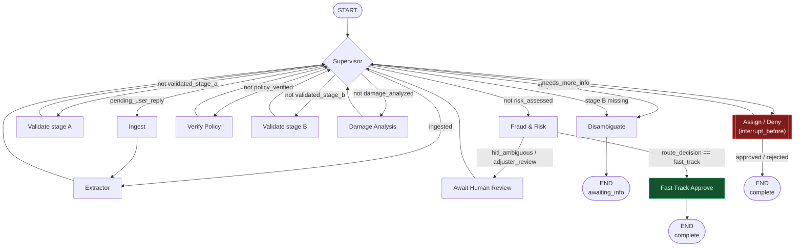

# Insurance Intake Agents (LangGraph Multi-Agent)

Two independent multi-agent intake pipelines, both built with LangGraph:

- **Policy application intake** (below) — `main.py` / `state.py` / `schema.py` / `tools.py` / `supervisor.py` / `graph.py` / `agents/`
- **[FNOL claims intake](#fnol-first-notice-of-loss-claims-intake)** — `fnol_main.py` / `fnol_state.py` / `fnol_schema.py` / `fnol_tools.py` / `fnol_guardrails.py` / `fnol_supervisor.py` / `fnol_graph.py` / `fnol_agents/`

They share a folder but no code — separate module names throughout so
neither pipeline can clobber the other.

---

## Policy Application Intake

A multi-agent **auto insurance policy application intake** pipeline built with
LangGraph. Collects applicant + vehicle details across turns, validates
completeness/format, screens underwriting risk, and produces a structured
application record.

### Architecture

```
              ┌─────────────┐
   User ─────►│ Supervisor  │◄────────────────┐
              └──────┬──────┘                 │
                      │ routes to              │
       ┌──────────────┼───────────────┬────────┴──────┐
       ▼               ▼               ▼               ▼
 ┌───────────┐  ┌────────────┐  ┌────────────┐  ┌────────────────┐
 │ Extractor │  │ Validator  │  │ Risk       │  │ Ask User       │
 │           │  │            │  │ Screener   │  │ (pause turn)   │
 └─────┬─────┘  └─────┬──────┘  └─────┬──────┘  └───────┬────────┘
       │              │               │                 │
       └──────────────┴───────────────┘                 ▼
                      ▼                                 END
               ┌────────────┐
               │  Finalize  │
               └──────┬─────┘
                      ▼
                     END
```

**Supervisor** – deterministic router. Intake is a fixed pipeline with one
conditional branch (missing info → ask the user), so a rule-based router is
simpler and more reliable than an LLM routing decision every turn.

**Extractor** – LLM structured-output extraction (`ApplicantExtraction`
pydantic schema) pulls whatever fields the latest message mentions and
merges them into `applicant_data`. No tool-calling here — pure field
extraction fits structured output better than an agentic tool loop.

**Validator** – checks the 10 required fields (name, DOB, email, phone,
address, license number, vehicle make/model/year/VIN) are present and
well-formed. Anything missing/invalid goes into `missing_fields`.

**Ask User** – turns `missing_fields` into a follow-up question and ends the
turn (`status: "awaiting_info"`); the caller supplies the reply and
re-invokes the graph.

**Risk Screener** – mock underwriting rules (young/senior driver, vehicle
age, accident/violation mentions in the conversation) → `risk_flags`,
`risk_tier` (low/medium/high), and a mock `premium_estimate`.

**Finalize** – assembles `final_application`: applicant data + risk tier +
premium + decision (`approved_pending_review` or `submitted_for_underwriting`
for high-risk cases).

### Quick Start

```bash
# 1. Install dependencies
pip install -r requirements.txt

# 2. Set your OpenAI key
cp .env.example .env
# then edit .env and fill in OPENAI_API_KEY

# 3. Run the scripted scenarios (complete info, follow-up loop, high-risk case)
python main.py

# 4. Or chat with the agent live
python main.py --interactive
```

### Files

| File | Description |
|---|---|
| `state.py` | Shared `IntakeState` TypedDict used by every node |
| `schema.py` | `ApplicantExtraction` pydantic schema, required fields, follow-up prompts |
| `tools.py` | Validation helpers (email/phone/VIN/year/DOB) + mock premium estimator |
| `agents/extractor.py` | Extracts fields from the latest message |
| `agents/validator.py` | Checks completeness/format of `applicant_data` |
| `agents/ask_user.py` | Asks the follow-up question, pauses the turn |
| `agents/risk_screener.py` | Mock underwriting risk scoring |
| `supervisor.py` | Deterministic router + `finalize_node` |
| `graph.py` | LangGraph `StateGraph` wiring |
| `main.py` | Entry point: scripted scenarios + `--interactive` chat mode |

### Customisation

- **Extend to another policy type** (home, health): add fields to
  `schema.py`, adjust `REQUIRED_FIELDS`/`FIELD_PROMPTS`, and update
  `risk_screener.py`'s rules.
- **Real underwriting rules**: swap the mock logic in `tools.py` /
  `agents/risk_screener.py` for real rating tables or an external API call.
- **Persistence across sessions**: add a LangGraph checkpointer
  (`MemorySaver` or a DB-backed one) so `ask_user` pauses can resume across
  process restarts instead of just within one `main.py` run. (The FNOL
  pipeline below already does this.)

---

## FNOL (First Notice of Loss) Claims Intake

A **production-shaped** multi-agent claims intake pipeline modeled on a
target enterprise architecture: multi-modal ingestion, a deterministic
guardrail rail in front of the LLM engine, a cyclic LangGraph state machine
with a Guidewire-style policy verification step, and risk-based conditional
routing — auto-approve only for genuinely low-risk claims, everything else
goes to a human, with Special Investigations Unit (SIU) escalation for the
highest-risk cases.

### Target architecture

This is the architecture the pipeline implements:

```
┌────────────────────────┐
│  Input Data Ingestion  │
│  (App text, PDF, Voice)│
└───────────┬────────────┘
            ▼
┌────────────────────────┐
│  Deterministic Rail    │   (fnol_guardrails.py — rule-based sanitizer;
│ (Input Sanitize Check) │    swap point for real NeMo Guardrails / Guardrails AI)
└───────────┬────────────┘
            ▼  (rejected input never reaches the graph)
┌──────────────────────────────────────────────────────────────────┐
│                       LANGGRAPH ENGINE                           │
│                                                                   │
│  Ingest ─► Extractor ─► Validate (stage A: policy #, name)        │
│                                │                                  │
│                    ┌───────────┴───────────┐                     │
│              (missing)                 (complete)                │
│                    ▼                         ▼                   │
│              Disambiguate ◄─┐        Verify Policy                │
│              (pause turn)   │        (Guidewire-style)            │
│                    │        │              │                     │
│                    │        │      Validate (stage B: loss detail)│
│                    │        │              │                     │
│                    │        │    ┌─────────┴─────────┐           │
│                    │        │ (missing)           (complete)     │
│                    │        └──────┘                  ▼          │
│                    │                          Multi-Modal          │
│                    │                          Damage Node          │
│                    │                                  │            │
│                    │                          Fraud & Risk          │
│                    │                          Evaluation Node       │
│                    │                                  │            │
└────────────────────┼──────────────────────────────────┼────────────┘
                      │                                  ▼
                      │                     [ Conditional Routing ]
                      │                     /        │          \
                      │        (risk < 0.3)/  (0.3–0.6) \  (risk ≥ 0.6
                      │                   /  ambiguous    \ or > $10k)
                      │                  ▼                 ▼         ▼
                      │           ┌──────────┐      ┌────────────┐ ┌──────────────────┐
                      │           │Fast Track│      │ Human in   │ │ Human Adjuster    │
                      │           │ Auto-    │      │ the Loop   │ │ Review Gate       │
                      │           │ Approve  │      │ Interrupt  │ │ (SIU Escalation)  │
                      │           └────┬─────┘      └─────┬──────┘ └────────┬──────────┘
                      │                │                  └────────┬────────┘
                      │                │                           │
                      │                ▼                           ▼
                      │       ┌──────────────────────────────────────────┐
                      └──────►│      Core CMS (Guidewire / Duck Creek)   │
                              └──────────────────────────────────────────┘
```

### How the implementation maps to it — and where it deliberately differs

| Diagram box | Implementation | Notes |
|---|---|---|
| Input Data Ingestion (App/PDF/Voice) | `fnol_main.run_preflight()` → `fnol_tools.extract_pdf_text` (real, via `pypdf`, OCR fallback via `pdf2image`+`pytesseract` for scanned/image-only PDFs) / `fnol_tools.transcribe_voice` (real, OpenAI Whisper) | Runs **before** a graph thread is even created |
| Deterministic Rail | `fnol_guardrails.run_deterministic_rail()` | Rule-based: prompt-injection patterns, SSN/card-number redaction, length checks. Swap point for real NeMo Guardrails / Guardrails AI |
| Ingest Node | `fnol_agents/ingest.py` | Inside the graph, this is just the state-machine kickoff — all real extraction already happened in the pre-flight step |
| Verify Policy (Guidewire API) | `fnol_agents/verify_policy.py` → `fnol_tools.verify_policy()` (mock PolicyCenter) | Split into two stages (see below) rather than one box |
| Missing Fields? / Disambiguate | `fnol_agents/validate_stage_a.py` + `validate_stage_b.py` + `fnol_agents/disambiguate.py` | **Two validation stages, not one.** Policy-identifying fields (policy #, name) are checked *before* Verify Policy runs — you can't look up a policy you don't have a number for. Full loss-detail fields are checked *after*, feeding a second Disambiguate pass if needed |
| Multi-Modal Damage Node | `fnol_agents/damage_analysis.py` → `fnol_tools.analyze_damage_photo()` (real, OpenAI vision) | Runs if a `photo_path` was attached; otherwise proceeds with a neutral placeholder |
| Fraud & Risk Evaluation Node | `fnol_agents/fraud_risk.py` → `fnol_tools.compute_risk_score()` | Also runs the full loss-coverage check (`check_loss_coverage`) here, now that loss_type/date are known, and **decides the routing outcome itself** (see thresholds below) |
| Conditional Routing | `route_after_risk()` in `fnol_graph.py`, reading `route_decision` set by fraud_risk_node | risk < 0.3 & in-coverage & ≤ $10k → `fast_track`; 0.3 ≤ risk < 0.6 → `hitl_ambiguous`; risk ≥ 0.6, amount > $10k, or coverage not in force → `adjuster_review` (SIU-flagged only when the *risk score itself*, not just claim value, crossed 0.6) |
| Fast Track Auto-Approve | `fnol_agents/fast_track_approve.py` | The **only** auto-approval path in the pipeline |
| Human in the Loop Interrupt / Human Adjuster Review Gate | `fnol_agents/await_human_review.py` + `fnol_agents/assign_or_deny.py`, gated by `interrupt_before=["assign_or_deny"]` | Both diagram gates share one implementation — same mandatory-human mechanics, differentiated by `route_decision`/`siu_escalated` in the printed summary and in `final_claim` |
| Core CMS (Guidewire / Duck Creek) | `fnol_tools.submit_to_cms()` | Mock — returns a generated claim ID; both `fast_track_approve` and `assign_or_deny` call it on a terminal decision |

### Actual graph wiring

The diagram above is the target architecture; this is what `fnol_graph.py`
literally builds — every node and edge below has a 1:1 line in the code.



Two things worth calling out that aren't obvious from the box shapes:

- **`ingest → extractor` is a direct edge**, not a supervisor round-trip —
  ingestion always leads straight to extraction, no branching in between.
- **`fraud_risk` picks its own next node.** Every other stage loops back to
  the supervisor for a decision; fraud_risk_node computes `route_decision`
  itself and its outgoing edge (`route_after_risk`) just acts on it
  directly — the supervisor is never consulted on the one decision that
  actually matters.

### Quick Start

```bash
# 1. Install dependencies
pip install -r requirements.txt

# 2. Set your OpenAI key
cp .env.example .env
# then edit .env and fill in OPENAI_API_KEY

# 3. Run the scripted scenarios — one per routing outcome:
#    fast-track auto-approve, HITL quick sign-off, adjuster+SIU (high risk),
#    adjuster review (lapsed policy → denied)
python fnol_main.py

# 4. Chat live (you play both claimant and reviewer)
python fnol_main.py --interactive

# 5. File a real claim from an actual PDF/audio file + photo
python fnol_main.py --claim --channel pdf --file claim_form.pdf --photo damage.jpg --claim-id my-claim-1
python fnol_main.py --claim --channel voice --file voicemail.m4a --claim-id my-claim-2
python fnol_main.py --claim --channel app --text "..." --photo damage.jpg --claim-id my-claim-3
```

### Files

| File | Description |
|---|---|
| `fnol_state.py` | Shared `FNOLState` TypedDict used by every node |
| `fnol_schema.py` | `ClaimExtraction` schema, `STAGE_A_FIELDS`/`STAGE_B_FIELDS`, follow-up prompts |
| `fnol_guardrails.py` | Deterministic Rail — rule-based input sanitizer (pre-graph) |
| `fnol_tools.py` | Mock Guidewire policy DB, PDF/voice/photo ingestion helpers, risk scoring, CMS submission, adjuster/SIU assignment |
| `fnol_agents/ingest.py` | State-machine kickoff — appends the pre-processed text as a `HumanMessage` |
| `fnol_agents/extractor.py` | Extracts claim fields from the latest message; for the `pdf` channel, classifies document type (claim form / police report / medical bill / repair estimate / other) and attaches a confidence score + low-confidence field list |
| `fnol_agents/validate_stage_a.py` | Checks policy-identifying fields before policy lookup |
| `fnol_agents/verify_policy.py` | Guidewire-style policy identity/status lookup |
| `fnol_agents/validate_stage_b.py` | Checks full loss-detail fields after policy verification |
| `fnol_agents/disambiguate.py` | Follow-up question for either validation stage; pauses the turn |
| `fnol_agents/damage_analysis.py` | Multi-modal damage-photo analysis (OpenAI vision) |
| `fnol_agents/fraud_risk.py` | Full coverage check + fraud/severity scoring + routing decision |
| `fnol_agents/fast_track_approve.py` | Auto-approval path (only reachable for risk < 0.3) |
| `fnol_agents/await_human_review.py` | Flags the claim for mandatory review (pairs with `interrupt_before`) |
| `fnol_agents/assign_or_deny.py` | Acts on the human reviewer's decision — the only other terminal node |
| `fnol_supervisor.py` | Deterministic router for the sequential collection/verification stages |
| `fnol_graph.py` | LangGraph `StateGraph` wiring + risk-based conditional edge + HITL gate |
| `fnol_main.py` | Pre-flight (ingestion + rail), SQLite checkpointer, scripted scenarios, `--interactive` and `--claim` (real file) modes |

### Persistence & HITL mechanics

State is checkpointed to a local SQLite DB (`fnol_checkpoints.sqlite`,
git-ignored) keyed by `thread_id` (the claim ID). The
`interrupt_before=["assign_or_deny"]` compile flag means that node
**physically cannot execute** until an external `graph.update_state()` call
has written `human_decision` — it halts on the edge into it every time a
claim reaches that point, whether that's the first pass or a repeat cycle
after `needs_more_info`. A claim can sit paused for review indefinitely,
including across process restarts — resume it later by re-running with the
same `claim_id`.

### Customisation

- **Real reviewer UI**: replace the `input()` prompts in `fnol_main.py`'s
  `awaiting_human_review` branch with a call into your claims queue /
  review dashboard; the mechanics (`update_state` + `invoke(None, config)`)
  stay the same regardless of where the decision comes from.
- **Document processing**: `fnol_agents/extractor.py` classifies PDF
  submissions into `DocumentType` (`fnol_schema.py`) and scores extraction
  confidence — add new document types / fields there. `low_confidence_fields`
  and `extraction_confidence` land in `FNOLState` but nothing currently acts
  on them; wiring them into `validate_stage_a`/`validate_stage_b` (e.g. treat
  a low-confidence required field as still missing) would push uncertain
  OCR reads back to the claimant for confirmation instead of silently
  trusting them.
- **Real Deterministic Rail**: `fnol_guardrails.run_deterministic_rail()` is
  the only place the rail logic lives — swap it for a real NeMo Guardrails
  or Guardrails AI call without touching anything else.
- **Swap the checkpoint backend**: `fnol_main.get_checkpointer()` is the
  only place that constructs the `SqliteSaver` — point it at Postgres
  (`langgraph-checkpoint-postgres`) for multi-process/deployed use.
- **Real coverage/fraud/CMS data**: swap the mock lookups in `fnol_tools.py`
  (`verify_policy`, `check_loss_coverage`, `compute_risk_score`,
  `submit_to_cms`) for calls into a real Guidewire/Duck Creek instance and
  fraud model — every one of those functions has a fixed, narrow contract
  so the swap doesn't ripple into the graph nodes that call them.
